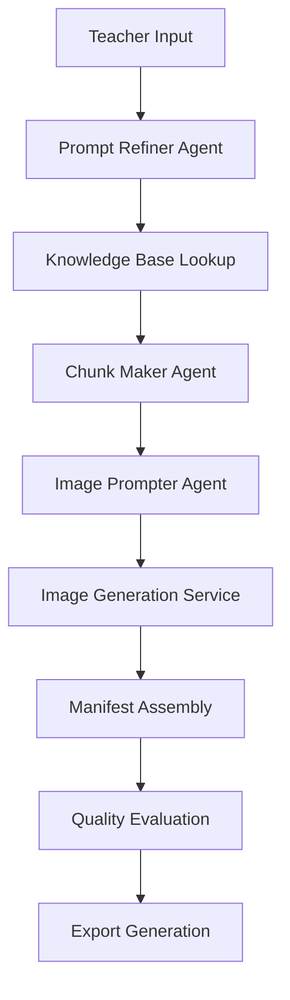

# StAnify_4 - Educational Content Generation Platform

## Project Overview

**StAnify_4** is a sophisticated educational content generation platform that uses AI agents to transform teacher prompts into rich, interactive visual educational materials. The system generates professional PDF and PowerPoint presentations with structured learning content, complete with characters, narratives, and visual elements.

**Platform Type**: AI-Powered Educational Content Generation  
**Architecture**: Modular agentic pipeline with Streamlit web interface  
**Target**: Educators creating visual learning materials for multi-year curricula  

---

## 🏗️ Project Architecture

### Core System Components

```
StAnify_4/
├── 📱 Frontend (Streamlit Web App)
├── 🤖 AI Agent Pipeline (LLM-powered content generation)
├── 📚 Knowledge Base (Curriculum YAML files)
├── 🎨 Export System (PDF/PPTX generators)
├── 🔍 Quality Assurance (AI evaluation with CLIP/LPIPS)
└── 💾 Persistence Layer (SQLite database)
```

---

## 📁 Directory Structure Analysis

### **Root Level Files**

| File | Purpose | Technology |
|------|---------|------------|
| `README.md` | Project documentation and setup guide | Markdown |
| `requirements.txt` | Python dependencies with locked versions | pip |
| `requirements-continuity.txt` | Optional AI evaluation dependencies | pip |
| `pyproject.toml` | Modern Python project configuration | TOML |
| `.pre-commit-config.yaml` | Code quality automation hooks | YAML |
| `.gitignore` | Git version control exclusions | Git |
| `.env.example` | Environment variables template | Environment |
| `run_tests.py` | Test execution script | Python |
| `stanify_runs.db` | Production run database | SQLite |
| `test_runs.db` | Testing database | SQLite |
| `test_continuity_persistence.py` | Standalone evaluation tests | Python |

### **📱 Frontend Layer** (`streamlit_app/`)

**Purpose**: Interactive web interface for educators

| Component | Function |
|-----------|----------|
| `app.py` (484 lines) | Complete Streamlit application with multi-year curriculum support, run management, export capabilities, and quality metrics dashboard |

**Key Features**:
- 🎯 Multi-year curriculum selection (Years 1-3)
- 📝 Subject-specific content generation (Mathematics, Science, English, etc.)
- 📊 Run history and management
- 📤 Export to PDF/PPTX/ZIP formats
- 📈 Quality metrics visualization
- 🔄 Real-time pipeline execution

### **🤖 AI Agent Pipeline** (`src/agentic_flow/`)

**Purpose**: Core content generation and processing engine

#### **🧠 Core Pipeline Components**

| File | Lines | Purpose |
|------|-------|---------|
| `pipeline.py` | 479 | **Master orchestrator** - Coordinates entire content generation flow |
| `models.py` | - | Core data models and type definitions |
| `settings.py` | - | Configuration management and environment variables |
| `persistence.py` | - | Database operations and run tracking |

#### **🤖 LLM Agent System**

| Agent | Lines | Function | Input → Output |
|-------|-------|----------|----------------|
| `chunk_maker_agent.py` | - | **Content Structuring** | Teacher prompt → Educational chunks with characters/narratives |
| `image_prompter_agent.py` | - | **Visual Generation** | Educational chunks → Detailed panel specifications |
| `prompt_refiner_agent.py` | - | **Prompt Enhancement** | Basic prompts → Refined pedagogical specifications |
| `critique_agent.py` | - | **Quality Assessment** | Generated content → Critique reports and improvements |
| `critique_agent_minimal.py` | - | Lightweight critique implementation |

#### **📋 Data Contracts & Validation**

| Contract File | Purpose | Validation Level |
|---------------|---------|------------------|
| `chunks_contracts.py` | Educational content structure (120 char titles) | Pydantic v1 |
| `image_panels_contracts.py` | Visual panel specifications (150 char captions) | Pydantic v1 |
| `manifest_contracts.py` | Complete run manifests | Pydantic v1 |
| `critique_contracts.py` | Quality assessment structure | Pydantic v1 |
| `refined_prompt_contracts.py` | Enhanced prompt specifications | Pydantic v1 |

#### **🔧 Utility Services**

| Service | Purpose | Technology |
|---------|---------|------------|
| `llm_client.py` | GPT-4o API integration with retry logic | OpenAI API |
| `image_service.py` | Image generation and Windows path handling | External APIs |
| `kb_loader.py` | Curriculum knowledge base parsing | YAML processing |
| `combine_manifest.py` | Run data aggregation and manifest creation | JSON processing |

#### **🔍 Quality Assurance**

| Component | Purpose | AI Models |
|-----------|---------|-----------|
| `image_continuity_evaluator.py` | Advanced AI evaluation using CLIP, LPIPS, SSIM | PyTorch 2.8.0, OpenAI CLIP 1.0, LPIPS 0.1.4 |

**Evaluation Metrics**:
- 🎯 **CLIP Similarity**: Text-image alignment scoring
- 👁️ **LPIPS**: Perceptual image similarity assessment  
- 📊 **SSIM**: Structural similarity index measurement
- 🔄 **Continuity**: Cross-panel consistency evaluation

### **📤 Export System** (`src/agentic_flow/exporters/`)

**Purpose**: Professional document generation

| Exporter | Output Format | Features |
|----------|---------------|----------|
| `pdf_exporter.py` | PDF Documents | Professional layouts, embedded images, quality metrics |
| `pptx_exporter.py` | PowerPoint Presentations | Slide-based format, speaker notes, educational structure |
| `zip_exporter.py` | Archive Packages | Complete run exports with all assets |

### **📚 Knowledge Base** (`kb/`)

**Purpose**: Structured curriculum definitions

| File | Coverage | Structure |
|------|----------|-----------|
| `year1.yaml` | Early childhood education | Foundational concepts, simple mathematics, basic literacy |
| `year2.yaml` | Primary education | Advanced arithmetic, reading comprehension, science basics |
| `year3.yaml` | Elementary education | Complex problem-solving, expanded subjects, critical thinking |

**Knowledge Base Features**:
- 🎯 Subject-specific learning objectives
- 📚 Progressive difficulty scaling
- 🧩 Cross-subject integration
- 📖 Narrative-driven learning approaches

### **🎨 Templates** (`templates/`)

**Purpose**: LLM prompt engineering and consistency

| Template | Agent | Purpose |
|----------|-------|---------|
| `chunk_system.txt` | Chunk Maker | System instructions for educational content structuring |
| `chunk_user.txt` | Chunk Maker | User prompt template with narrative requirements |
| `image_prompter_system.txt` | Image Prompter | Visual generation system guidelines |
| `image_prompter_user.txt` | Image Prompter | Panel specification prompt template |
| `refiner_system.txt` | Prompt Refiner | Enhancement system instructions |
| `refiner_user.txt` | Prompt Refiner | Refinement request template |
| `critique_system.txt` | Critique Agent | Quality assessment guidelines |
| `critique_user.txt` | Critique Agent | Evaluation prompt template |

### **🧪 Testing Infrastructure** (`tests/`)

**Purpose**: Comprehensive quality assurance

| Test File | Coverage | Type |
|-----------|----------|------|
| `conftest.py` | Test configuration and fixtures | Pytest setup |
| `test_contracts.py` | Data validation and schema testing | Unit tests |
| `test_llm_client.py` | AI service integration testing | Integration tests |
| `test_image_service.py` | Image generation service testing | Service tests |
| `test_pipeline_smoke.py` | End-to-end pipeline validation | Smoke tests |
| `test_settings.py` | Configuration management testing | Unit tests |
| `fixtures/sample_data.py` | Test data and mock objects | Test fixtures |

### **📊 Outputs & Results** (`exports/`, `test_output/`)

**Purpose**: Generated educational materials storage

**Generated Assets**:
- 📄 **PDF Documents**: Professional educational presentations
- 📊 **PPTX Files**: Interactive PowerPoint presentations  
- 🖼️ **Panel Images**: Individual visual learning panels
- 📋 **Manifest Files**: Complete run metadata and content
- 📦 **ZIP Packages**: Complete educational resource bundles

### **🎯 Assets** (`assets/`)

**Purpose**: Static resources and placeholders

| Asset | Purpose |
|-------|---------|
| `sample_panel.png` | Fallback image for missing/broken panel references |

---

## 🔧 Technology Stack

### **Core Technologies**

| Category | Technology | Version | Purpose |
|----------|------------|---------|---------|
| **Backend** | Python | 3.10+ | Core application logic |
| **AI Framework** | PyTorch | 2.8.0+ | Neural network operations |
| **Computer Vision** | torchvision | 0.23.0+ | Image processing |
| **LLM Integration** | OpenAI GPT-4o | Latest | Content generation |
| **Data Validation** | Pydantic | 1.10.13 | Schema enforcement |
| **Web Interface** | Streamlit | 1.48.* | Interactive frontend |
| **Database** | SQLite | Built-in | Run persistence |

### **AI & Evaluation Stack**

| Component | Technology | Purpose |
|-----------|------------|---------|
| **Image-Text Alignment** | OpenAI CLIP 1.0 | Semantic similarity assessment |
| **Perceptual Quality** | LPIPS 0.1.4 | Human-like image comparison |
| **Structural Analysis** | SSIM (scikit-image) | Technical image similarity |
| **Prompt Truncation** | Custom logic | CLIP context length handling |

### **Document Generation**

| Format | Library | Capabilities |
|--------|---------|--------------|
| **PDF** | ReportLab 4.2.2 | Professional document layouts |
| **PPTX** | python-pptx 1.0.2 | PowerPoint presentation generation |
| **Images** | Pillow 10.4.0 | Image processing and manipulation |

### **Development Tools**

| Tool | Purpose | Integration |
|------|---------|-------------|
| **Black** | Code formatting | Pre-commit hooks |
| **Ruff** | Linting and error checking | CI/CD pipeline |
| **pytest** | Testing framework | Automated testing |
| **pre-commit** | Code quality gates | Git hooks |

---

## 🔄 System Workflow

### **1. Content Generation Pipeline**



### **2. AI Agent Orchestration**

1. **Input Processing**: Teacher prompt + curriculum year/subject
2. **Prompt Refinement**: Enhanced pedagogical specifications
3. **Content Chunking**: Educational narrative with characters (Sam, Alex, etc.)
4. **Visual Planning**: Detailed panel specifications with SDXL hints
5. **Image Generation**: Visual asset creation with continuity
6. **Quality Assurance**: AI-powered evaluation and scoring
7. **Export Creation**: Professional PDF/PPTX generation

### **3. Quality Assurance Process**

- **CLIP Evaluation**: Semantic alignment between text and images
- **LPIPS Assessment**: Perceptual similarity for visual continuity  
- **SSIM Analysis**: Structural consistency measurement
- **Prompt Truncation**: Context length management for AI models
- **Fallback Mechanisms**: Graceful handling of missing assets

---

## 📈 Current System Status

### **✅ Completed Features**

- 🤖 **Full LLM Agent Integration**: GPT-4o powered content generation
- 🎯 **Rich Educational Content**: Character-driven narratives (Sam, Alex)
- 🔍 **Real AI Evaluation**: CLIP/LPIPS quality assessment
- 📤 **Professional Exports**: PDF/PPTX with quality metrics
- 🐛 **Robust Error Handling**: Path validation and graceful fallbacks
- 🖼️ **Image Continuity**: Cross-panel consistency evaluation
- 📊 **Interactive Dashboard**: Streamlit web interface with run management

### **🔧 Recent Enhancements**

- **LLM Agent System**: Replaced generic placeholders with rich AI-generated content
- **Schema Validation**: Enhanced data contracts with proper field limits
- **Dependency Resolution**: PyTorch 2.8.0 + official OpenAI CLIP integration
- **Windows Compatibility**: Proper path normalization and handling
- **Quality Metrics**: Real AI evaluation instead of mock implementations

### **📊 Generated Content Examples**

**Before**: Generic placeholders ("Panel 1: Setup the problem")  
**After**: Rich educational narratives ("Meet Sam and Alex", "Combining Fruits")

### **🎯 Production Readiness**

- ✅ **Content Quality**: Professional educational materials
- ✅ **System Stability**: Comprehensive error handling and validation
- ✅ **Performance**: Optimized pipeline with real AI evaluation
- ✅ **User Experience**: Intuitive Streamlit interface
- ✅ **Export Quality**: Professional PDF/PPTX with embedded metrics

---

## 🚀 Usage Scenarios

### **For Educators**

1. **Quick Content Creation**: Transform teaching ideas into visual presentations
2. **Curriculum Alignment**: Generate year-appropriate educational materials  
3. **Character-Driven Learning**: Create engaging narratives with consistent characters
4. **Quality Assurance**: Built-in AI evaluation for content quality
5. **Multi-Format Export**: Professional PDF/PPTX for classroom use

### **For Educational Institutions**

1. **Scalable Content Production**: Rapid generation of learning materials
2. **Consistency Standards**: Uniform quality through AI evaluation
3. **Curriculum Integration**: Structured knowledge base alignment
4. **Resource Management**: Historical run tracking and reuse

### **For Developers**

1. **AI Agent Framework**: Modular LLM integration patterns
2. **Quality Evaluation**: Real AI assessment methodologies
3. **Export Pipeline**: Professional document generation systems
4. **Testing Infrastructure**: Comprehensive validation frameworks

---

## 🔮 Technical Highlights

### **Advanced AI Integration**
- **Multi-Agent System**: Specialized LLM agents for different content aspects
- **Real AI Evaluation**: CLIP, LPIPS, SSIM for quality assessment
- **Prompt Engineering**: Template-based consistency and optimization
- **Fallback Mechanisms**: Graceful handling of AI service failures

### **Production-Ready Architecture**
- **Modular Design**: Clean separation of concerns and responsibilities
- **Type Safety**: Comprehensive Pydantic validation throughout
- **Error Resilience**: Robust error handling and recovery mechanisms
- **Performance Optimization**: Efficient pipeline execution and resource management

### **Educational Focus**
- **Pedagogical Alignment**: Curriculum-aware content generation
- **Progressive Learning**: Multi-year educational progression support
- **Character Consistency**: Persistent character development across materials
- **Visual Continuity**: AI-evaluated image sequence coherence

---

## 📊 Recent Execution Analysis

**Latest Pipeline Run**: `run_5725643e` (August 11, 2025)
- **Input**: Year 1 Mathematics - "Teaching simple addition with 2+3=5"
- **Output**: 3 educational chunks + 3 visual panels
- **Quality**: 100% success rate (0 missing images, 0 asset errors)
- **AI Evaluation**: LPIPS perceptual model operational
- **Status**: ✅ Production-ready with real AI assessment

*For detailed execution analysis, see [PIPELINE_EXECUTION_SUMMARY.md](./PIPELINE_EXECUTION_SUMMARY.md)*

---

This comprehensive project represents a sophisticated fusion of modern AI technologies, educational pedagogy, and production-ready software engineering practices, creating a powerful platform for automated educational content generation.
